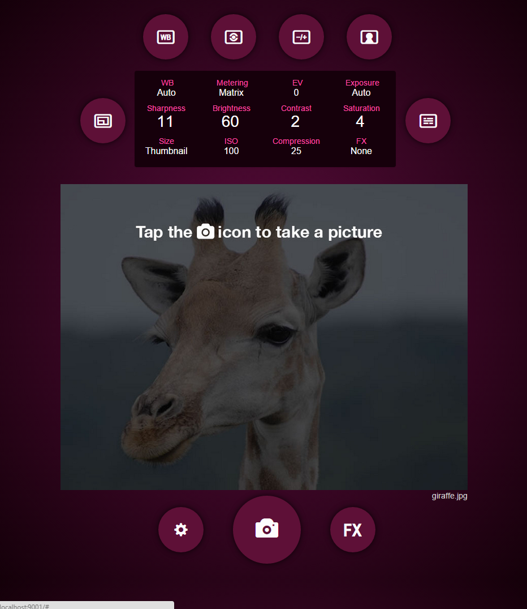

# BerryCam  Aurelia

## Simple port of BerryCam Express written with Aurelia

- http://pitography.github.io/BerryCamExpress
- http://aurelia.io/

## Running the web server - live mode

1. Ensure that [NodeJS](http://nodejs.org/) is installed.
2. Ensure that [Gulp](http://gulpjs.com/) is installed globally. If you need to install it, use the following command:

    ```shell
    npm install -g gulp
    ```
3. Ensure that [jspm](http://jspm.io/) is installed. If you need to install it, use the following command:

    ```shell
    npm install -g jspm
    ```
4. Check out the project onto your pi

   ```shell
   git clone https://github.com/stevies/berrycam-aurelia-v2.git
   ```

4. From the project folder, execute the following commands:

    ```shell
    npm install
    jspm install -y
    gulp bundle
    ```
    The 'npm install' command might take a long time - that is normal.  You might
    also get a few errors - just run 'npm install' it again until they go away and you get a clean build
    (or hope they are not fatal, and just skip ahead and try to run the app anyway).

5.  That should build the application ready to run - you should see a 'deploy' directoy - cd into that:

    ```
    cd deploy
    node server.js
    ```

6. That should launch the server - you should see something like this in your console:

    ```
    pi@raspberrypi ~/berrycam-aurelia/deploy $ node server.js
    Production mode true
    B E R R Y C A M   E X P R E S S -- Listening on port 3000
    ```
7. Open a browser at your pi's hostname / ipaddress - eg

    ```
    http://pi:3000
    http://192.168.0.10:3000
    ```
8. Should look like this when it is running:
   
