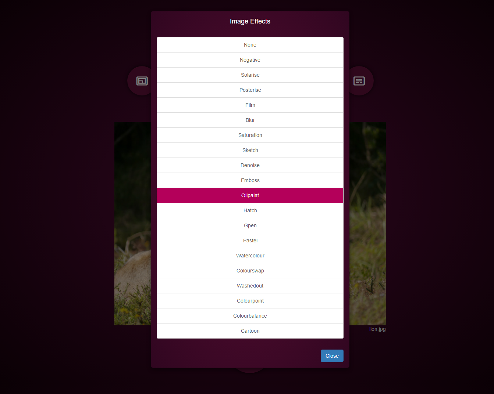

# Converting BerryCam to Aurelia
The native [iPhone BerryCam app](http://www.fotosyn.com/berrycam/) - written by
[Jim Moore](https://www.linkedin.com/in/jimoore) - allows the user to remotely take pictures using a Raspberry Pi
camera.

Early in 2014 I converted BerryCam to JavaScript. I used [Knockout.js](http://knockoutjs.com) for the
front end, and [Express](http://expressjs.com/) for the backend. This was launched as
[BerryCam Express](http://pitography.github.io/BerryCamExpress). You can read Jim's original
[blog post about this](http://www.fotosyn.com/blog/berrycam-express-is-now-available).

Since then, I've rewritten BerryCam Express a few times using different JavaScript frameworks - for example, there is a
[port to Angular](https://github.com/stevies/BerrycamExpressAngular).  I've not built or run that one for a while, so
it may not be in a working state.

Back in May 2015, shortly after I discovered Aurelia, I did a very quick BerryCam Express conversion.  The development
and learning process went very smoothly and quickly - I was immediately struck by how Aurelia allowed me to create a
clean and simple application and code structure. And it was a good way for me to force myself to try to learn some
ES6 and ES7. Although I the got the app mostly working, I never really finished it, and neglected to keep it
up-to-date with later Aurelia releases (it was based on aurelia-framework v0.13.2).

Skip forward a few months - time for another rewrite.

## Running BerryCam for Aurelia on the Raspberry Pi

### Preparing your Raspberry Pi for Node.js
First of all make sure that you have the latest version of raspbian running on your Raspberry Pi:
```
sudo apt-get update
sudo apt-get upgrade
```
#### Install NodeJS and Node Package Manager

Install the Node packages for Raspberry Pi. These will be downloaded into the `/home/pi` folder:
```
wget http://nodejs.org/dist/v0.10.28/node-v0.10.28-linux-arm-pi.tar.gz
cd /usr/local
sudo tar -xvzf ~/node-v0.10.28-linux-arm-pi.tar.gz --strip=1
```
Once this is completed, check the version installed:
```
node -v
```
You should see `v0.10.28` or the version that you have installed. This concludes that NodeJS is now installed.
Check that the Node Package Manager is installed:
```
npm -v
```
which should reveal the version number `1.2.15` or the version that you have installed.

#### Update Node.js
You can now update node to the latest stable version.
```
sudo npm cache clean -f
sudo npm install -g n
sudo n stable
```
There may be an eaier one-stop way to get the latest version of note installed. Perhaps
```
wget https://nodejs.org/dist/v4.1.1/node-v4.1.1-linux-armv7l.tar.gz
cd /usr/local
sudo tar -xvzf ~/node-v4.1.1-linux-armv7l.tar.gz --strip=1
```
might get the latest. I've not tried that.

#### Install gulp and jspm
We'll actually be checking out the BerryCam project from GitHub and building it directly on the Pi, so we need to do
some of the usual Aurelia setup.
```
npm install -g gulp
npm install -g jspm
```
#### Check out the BerryCam Aurelia project onto your Pi
```
git clone https://github.com/stevies/berrycam-aurelia.git
```
#### Build and bundle the app
Go to the project directory:
```
cd berrycam-aurelia
```
Then run
```
npm install
```
That could take over 40 minutes on a Pi 2 (on the original Pi 1 it will be many hours).  This is normal: the Pi is slow
doing file IO and we are processing a lot of files.

You might also see some errors (I saw a few complaints about 'node-gyp'). You can try running 'npm install' again
(it will get quicker to do this as files get cached) or just igonore them and hope they are not fatal.

When the npm packages are full installed, you can then run:
```
jspm install
```
And then:
```
gulp bundle
```
These tasks will also take a bit of time to complete.

#### Run the server app
Once all the above steps complete, you should have a built app ready to run. You should have a 'deploy' directory
containing all the bundled files and the server.js script that you need to run.
```
cd deplopy
node server.js
```
That should launch the server - you should see something like this in your console:
```
pi@raspberrypi ~/berrycam-aurelia/deploy $ node server.js
Production mode true
B E R R Y C A M   E X P R E S S -- Listening on port 3000
```
Open a browser on at your Pi's hostname or IP address at port 3000 - eg:
```
http://pi:3000
```
You should see the client app load. It will look like this.


You can modify the image settings such as size, compression, ISO, or flip vertically or horizontally.


Or adjust brightness, sharpness, contrast or saturation,


You can apply one of many image effects


When you have set-up the camera, then click the big button at the bottom to send your request to the Camera on the Pi.

If everything works, you should get to see your photograph after a second or so. Expample of "oilpaint" effect:


## The application code

### Client code - Aurelia
There really is nothing special about the code for this application. It does not use any weird or complex features of
Aurelia.  It is about as basic as it gets - really only one view/viewmodel that represents the Camera - and holds all
the individual camera settings and image properties that need to be sent to the server program via the Aurelia
HttpClient.

There are some examples of custom elements - ActivityIndicator, CameraControls, Modal and a wrapper for a jQuery slider
control [bootstrap-slider](https://github.com/seiyria/bootstrap-slider)

#### Project structure
One thing that is a bit different from the usual Aurelia Skeleton Navigation is the project structure. I had a
requirement in another project that the basic directory needed to be one level deeper than the flat
structure in the skeleton - eg - all source code under '/app':
```
berrycam-aurelia
- app
-- fonts
-- images
-- jspm_packages
-- src
-- styles
-- config.js
-- index.html
- dist
- server
package.json
```
instead of
```
skeleton-navigation
- src
- jspm_packages
- styles
config.js
index.hmtl
package.json
```
I have carried that over into this example simply because I had that structure already set up.  It causes some
challenges - the build process has an extra step to copy everything into a tmp directory so as not to modify the
original config.js. And it means copying jspm_packages (or bits of it) around.

#### Running locally
It is possible to run the application locally in development mode. Clone the project as normal. Then run
```
gulp watch
```
With no server backend running, you'll get errors when trying to take a photograph, but the client will do work OK
loaded on http://localhost:9000

If you run the backend server off the Pi with environment variable:
```
NODE_ENV=dev
```
It will bypass the camera and return a hard-coded fake picture to the web client.


#### Aurelia Bundling
I really did not want to serve-up an unbundled app from the Pi. Therefore, I have spent some time getting Aurelia
bundler to work.  My project structure means a bit of extra copying files around - and I might still have some
work to do to tidy-up the gulp scripts - I've got some copy/paste duplication in there that should be fixed.

### Server code - Express

The backend is a simple Express server that listens for Http GET requests coming in on /berrycam.  A typical request
would be:
```
Request URL:http://localhost:3000/berrycam?ISO=100&awb=Auto&br=60
&co=2&ev=0&ex=Auto&exif=IFD1.Software%3DBerryCam%20-x%20EXIF.MakerNote%3DBerryCam%20-x%20EXIF.UserComment%3DBerryCam
&h=162&ifx=None&mm=Matrix&mode=photo&q=25&sa=4&sh=11&t=1000&w=216
```
I used the [node-raspicam](https://github.com/troyth/node-raspicam) library to simplify talking to the camera hardware.


